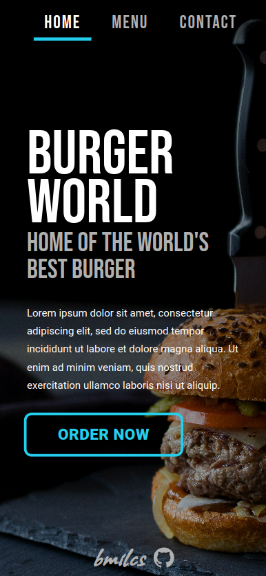
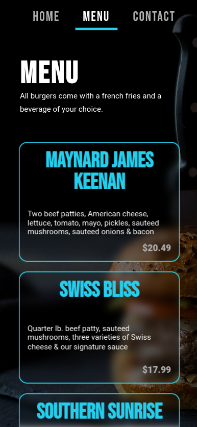
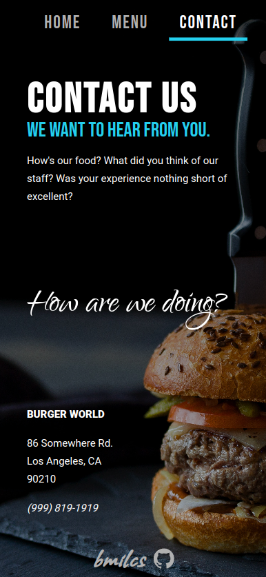
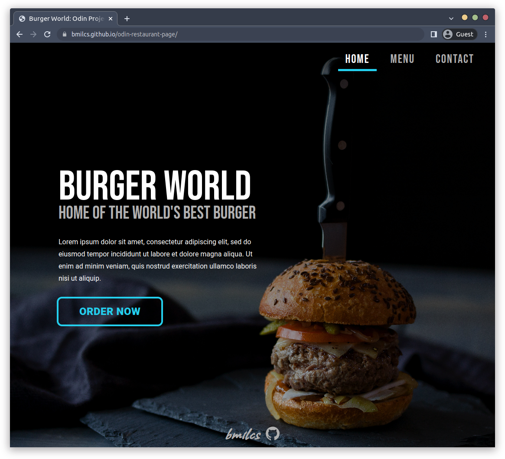
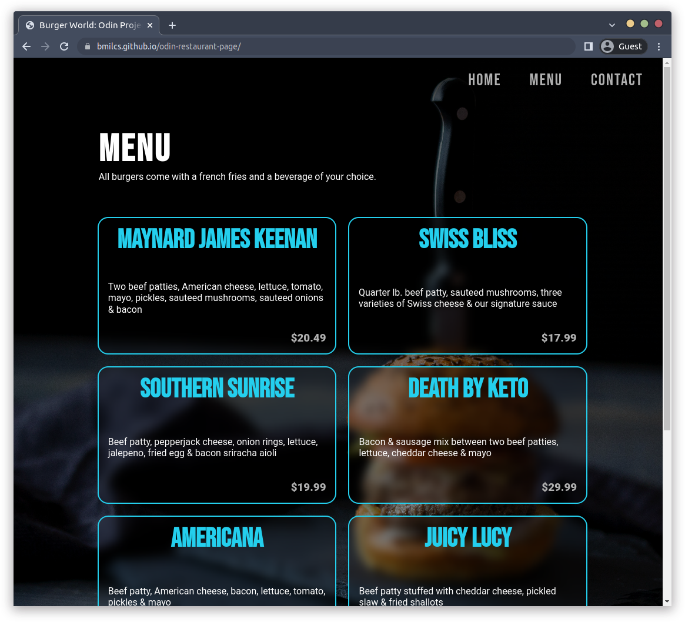
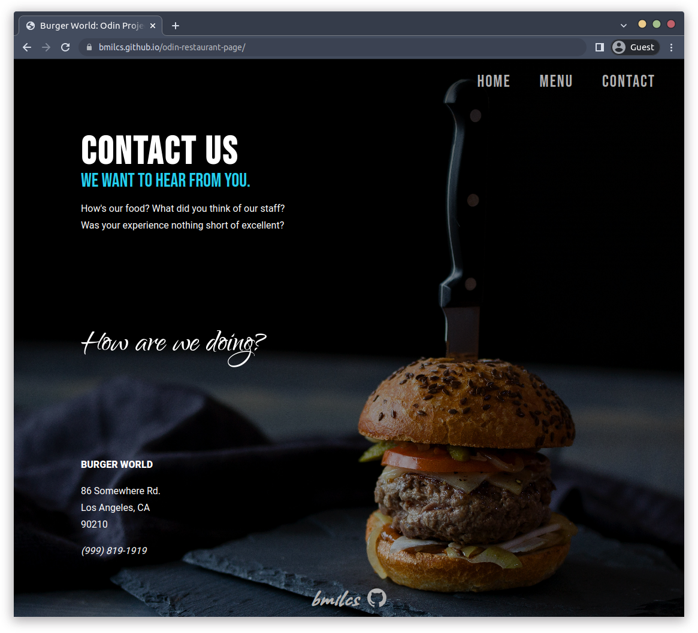

# Odin Project #10: Restaurant Page

Welcome to Bryan Miller's Restaurant Page Project, the [tenth assignment](https://www.theodinproject.com/lessons/node-path-javascript-restaurant-page) within the Odin Project curriculum. The goal of this repo is to practice the following skill sets:

- JavaScript
  - `npm`
  - `webpack`
    - inline source map
    - dev server
    - asset management
    - html plugin
    - sass loader
    - raw-loader
  - ES6 Modules
  - Classes
  - Array methods: `reduce()` and `forEach()`
- SASS

## Summary

With the introduction of `npm`, `webpack` and ES6 Modules, I'm finally getting a taste of modern web development. Here's how I utilized these new skills to create this project:

1. Setup `webpack` to bundle all of my modules. `HtmlWebpackPlugin` & `template.html`, reduced HTML written to the boilerplate with a single `div` for the contents of the entire site. `inline-source-maps` made debugging a breeze and `raw-loader` was used to import SVG HTML directly into the footer module without cluttering up the HTML. `sass-loader` took care of bundling all of the `.scss` files, which were segmented by their use case.
2. With the dev environment setup, limiting the number of `.createElement()`, `.textContent` and `.classList` lines were the focus of the planning stage. I created a utility function `createElement()` to save time & keep things D.R.Y.
3. I built out each page, nesting elements created with the utility function inside arrays. Array's `forEach()` method allowed me to keep `.appendChild()` lines to a minimum.
4. The Menu Module was the most enjoyable part of the project. It was the perfect opportunity to practice working with classes, objects, arrays & array methods (`reduce()` in particular.)

   - `MenuItem` Class: creates burger objects, containing their name, ingredients and price. Within the constructor, I assigned the `html` key to the `getHTML()` method, which returns the fully assembled DOM-ready container element.
   - The `prepMenuItemContainers()` function creates all of the menu item objects with the `MenuItem` class and stores them within an array. Using the `reduce()` method and the spread operator, this function returns a new array of fully assembled menu item dom elements.
   - `prepareMenu()` completes the final assembly of the menu page using the same strategy explained above: arrays of html elements that are appended to the page via `forEach()` method.

In closing, this project has renewed my excitement for web development and I'm looking forward to diving into API's, React and developing fully featured web applications. Taking the time to learn `reduce()`, a challenging concept to grasp at first, was worthwhile and it's going to be extremely useful going forward.

## Links

- [Live Demo](https://bmilcs.github.io/odin-restaurant-page/)
- [My Odin Project Progress](https://github.com/bmilcs/odin-project)

## Screenshots

> Mobile Screenshot: Home



> Mobile Screenshot: Menu



> Mobile Screenshot: Contact



> Desktop Screenshot: Home



> Desktop Screenshot: Menu



> Desktop Screenshot: Contact



## Deployment

```sh
# clone repo
git clone https://github.com/bmilcs/odin-restaurant-page.git

# install dev dependencies
cd odin-restaurant-page
npm install --save-dev webpack webpack-cli webpack-dev-server html-webpack-plugin style-loader css-loader sass-loader sass
```
